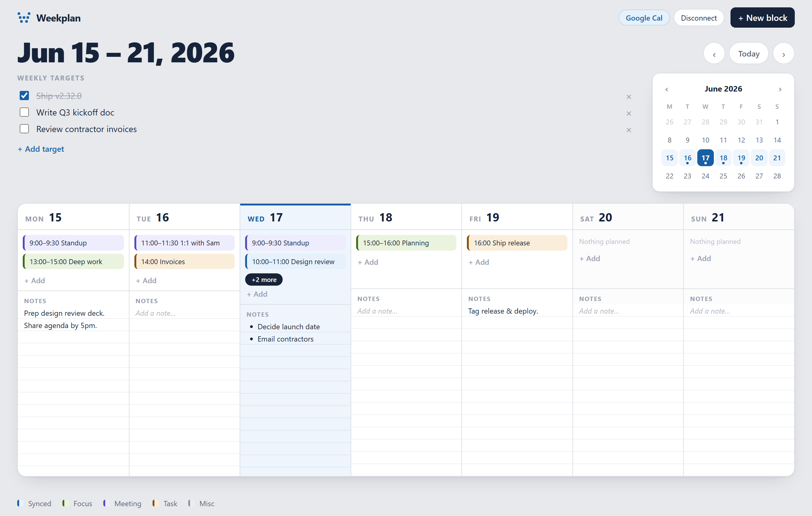

# Weekplan

A simple, opinionated **weekly planner** — see your whole week at a glance, drop in time blocks, jot notes, and track a few weekly targets. Mobile-first PWA, works offline, no account required.

Built as a deliberately minimal **vanilla** app: plain HTML/CSS/JS ES modules, **no framework, no build step, no backend.** All your data lives in `localStorage` on your device.

**▶ Live demo: https://rochdesigns.github.io/weekplan/**



## Features

- **Week grid** — Monday–Sunday, each day split into time blocks (top) and freeform notes (bottom)
- **Time blocks** — add/edit/delete via a modal, with start + end time and a colour category (synced · focus · meeting · task · misc)
- **WYSIWYG notes** — per-day rich notes (bold/italic/underline/lists) on a ruled-paper surface, auto-saved
- **Weekly targets** — a per-week checklist
- **Mini month calendar** — jump between weeks; event dots; today highlighted
- **Week navigation** — prev/next, "Today", or click a day in the mini calendar
- **Optional Google Calendar** — read-only sync (dormant until you add a client ID — see below)
- **PWA** — installable, offline-capable
- **Accessible** — keyboard focus rings, reduced-motion support, ≥44px touch targets

## Run it locally

The app uses ES modules and a service worker, so it must be **served over HTTP** — opening `index.html` directly as a `file://` URL will not work.

Any static server does the job:

```bash
# Node
npx serve .

# or Python
python -m http.server 8000
```

Then open `http://localhost:8000`. (Or drop the folder in XAMPP's `htdocs` and visit `http://localhost/weekly-planner/`.) `localhost` counts as a secure context, so the service worker and install prompt work without HTTPS.

## Tests

Pure logic (date math, storage, the notes sanitizer, block moves) is unit-tested with the built-in Node test runner — no dependencies to install:

```bash
node --test test/      # Node 18+
# or
npm test
```

UI/interaction behaviour is verified manually in the browser.

## Google Calendar (optional)

Calendar sync is **off by default** and the app is fully usable without it. To enable read-only sync:

1. Create an OAuth 2.0 Client ID in [Google Cloud Console](https://console.cloud.google.com/) (Web application), authorising your origin (e.g. `http://localhost:8000`).
2. Set it in [`js/gcal.js`](js/gcal.js):
   ```js
   export const CLIENT_ID = 'YOUR_CLIENT_ID.apps.googleusercontent.com';
   ```
3. The live OAuth consent + event-pull flow is a documented seam in `gcal.js` (V1 ships the stub); wire `fetchWeekEvents()` to your fetch.

## Deploy

It's fully static — host it anywhere: Netlify, Vercel, Cloudflare Pages, GitHub Pages. No backend, no env vars.

## Project structure

```
index.html            app shell (four zones)
manifest.json  sw.js  PWA manifest + service worker
css/   base · grid · mini-cal · blocks · modal
js/    app · store · dates · week · blocks · notes · sanitize · targets · mini-cal · gcal · modal
test/  dates · store · sanitize  (node --test)
```

`store.js` is the single module that touches `localStorage` and exposes an **async** API — the intended seam for swapping in a backend later without touching the UI.

## Scope & roadmap

**V1 (this release):** everything above, entirely client-side.

**Deferred to V2:** user accounts, cross-device sync, a backend/database, billing, Apple/Outlook calendars, writing back to Google, recurring events, drag-and-drop, dark mode.

## License

[MIT](LICENSE) © 2026 rochdesigns
